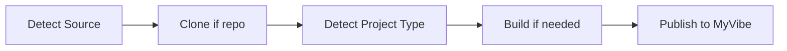

# Git Repo Publish & Extended Framework Detection — Implementation Plan

> **For Claude:** REQUIRED SUB-SKILL: Use superpowers:executing-plans to implement this plan task-by-task.

**Goal:** Enable publishing directly from a Git repository URL and support 9 additional web frameworks with a generic fallback.

**Architecture:** Add `clone-repo.mjs` utility script for Git operations. Extend `publish.mjs` to handle `source.type: "repo"`. Expand SKILL.md Step 1 detection table and add Step 0 for repo resolution. All new code follows existing patterns (ESM, UX engine, error codes, vitest).

**Tech Stack:** Node.js ESM, child_process (git), vitest, existing UX engine

---

### Task 1: Add Git-related error codes to constants

**Files:**
- Modify: `skills/myvibe-publish/scripts/utils/constants.mjs`
- Modify: `skills/myvibe-publish/scripts/utils/__tests__/constants.test.mjs`

**Step 1: Write the failing test**

Add to `__tests__/constants.test.mjs`:

```javascript
it('should export git-related error codes', () => {
  expect(ERROR_CODES.GIT_CLONE_FAILED).toBe('GIT_CLONE_FAILED')
  expect(ERROR_CODES.GIT_AUTH_FAILED).toBe('GIT_AUTH_FAILED')
  expect(ERROR_CODES.GIT_NOT_FOUND).toBe('GIT_NOT_FOUND')
  expect(ERROR_CODES.INVALID_REPO_URL).toBe('INVALID_REPO_URL')
  expect(ERROR_CODES.SUBDIR_NOT_FOUND).toBe('SUBDIR_NOT_FOUND')
})

it('should have hints for git error codes', () => {
  expect(ERROR_HINTS[ERROR_CODES.GIT_CLONE_FAILED]).toBeDefined()
  expect(ERROR_HINTS[ERROR_CODES.GIT_AUTH_FAILED]).toBeDefined()
  expect(ERROR_HINTS[ERROR_CODES.GIT_NOT_FOUND]).toBeDefined()
  expect(ERROR_HINTS[ERROR_CODES.INVALID_REPO_URL]).toBeDefined()
  expect(ERROR_HINTS[ERROR_CODES.SUBDIR_NOT_FOUND]).toBeDefined()
})
```

**Step 2: Run test to verify it fails**

Run: `cd skills/myvibe-publish/scripts && npx vitest run utils/__tests__/constants.test.mjs`
Expected: FAIL — `ERROR_CODES.GIT_CLONE_FAILED` is undefined

**Step 3: Write minimal implementation**

Add to `constants.mjs` ERROR_CODES object:

```javascript
GIT_CLONE_FAILED: 'GIT_CLONE_FAILED',
GIT_AUTH_FAILED: 'GIT_AUTH_FAILED',
GIT_NOT_FOUND: 'GIT_NOT_FOUND',
INVALID_REPO_URL: 'INVALID_REPO_URL',
SUBDIR_NOT_FOUND: 'SUBDIR_NOT_FOUND',
```

Add to ERROR_HINTS object:

```javascript
[ERROR_CODES.GIT_CLONE_FAILED]: 'Check the repository URL and your network connection',
[ERROR_CODES.GIT_AUTH_FAILED]: 'For private repos, use --git-token or configure SSH keys',
[ERROR_CODES.GIT_NOT_FOUND]: 'Git is not installed. Install git and try again',
[ERROR_CODES.INVALID_REPO_URL]: 'Provide a valid HTTPS or SSH git URL',
[ERROR_CODES.SUBDIR_NOT_FOUND]: 'The --path subdirectory does not exist in the repository',
```

**Step 4: Run test to verify it passes**

Run: `cd skills/myvibe-publish/scripts && npx vitest run utils/__tests__/constants.test.mjs`
Expected: PASS

**Step 5: Commit**

```bash
git add skills/myvibe-publish/scripts/utils/constants.mjs skills/myvibe-publish/scripts/utils/__tests__/constants.test.mjs
git commit -m "feat: add git-related error codes and hints"
```

---

### Task 2: Create `clone-repo.mjs` with tests

**Files:**
- Create: `skills/myvibe-publish/scripts/utils/clone-repo.mjs`
- Create: `skills/myvibe-publish/scripts/utils/__tests__/clone-repo.test.mjs`

**Step 1: Write the failing tests**

Create `__tests__/clone-repo.test.mjs`:

```javascript
import { describe, it, expect } from 'vitest'
import { parseRepoUrl, injectToken, buildCloneArgs } from '../clone-repo.mjs'

describe('parseRepoUrl', () => {
  it('should accept HTTPS GitHub URL', () => {
    const result = parseRepoUrl('https://github.com/user/repo')
    expect(result).toEqual({ valid: true, protocol: 'https', url: 'https://github.com/user/repo' })
  })

  it('should accept HTTPS URL with .git suffix', () => {
    const result = parseRepoUrl('https://github.com/user/repo.git')
    expect(result).toEqual({ valid: true, protocol: 'https', url: 'https://github.com/user/repo.git' })
  })

  it('should accept SSH URL', () => {
    const result = parseRepoUrl('git@github.com:user/repo.git')
    expect(result).toEqual({ valid: true, protocol: 'ssh', url: 'git@github.com:user/repo.git' })
  })

  it('should reject invalid URL', () => {
    const result = parseRepoUrl('not-a-url')
    expect(result.valid).toBe(false)
  })

  it('should reject empty string', () => {
    const result = parseRepoUrl('')
    expect(result.valid).toBe(false)
  })
})

describe('injectToken', () => {
  it('should inject token into HTTPS URL', () => {
    const result = injectToken('https://github.com/user/repo.git', 'ghp_abc123')
    expect(result).toBe('https://ghp_abc123@github.com/user/repo.git')
  })

  it('should return SSH URL unchanged', () => {
    const result = injectToken('git@github.com:user/repo.git', 'ghp_abc123')
    expect(result).toBe('git@github.com:user/repo.git')
  })

  it('should return URL unchanged when no token', () => {
    const result = injectToken('https://github.com/user/repo.git', undefined)
    expect(result).toBe('https://github.com/user/repo.git')
  })
})

describe('buildCloneArgs', () => {
  it('should build basic clone args', () => {
    const args = buildCloneArgs('https://github.com/user/repo.git', '/tmp/dest')
    expect(args).toEqual(['clone', '--depth', '1', 'https://github.com/user/repo.git', '/tmp/dest'])
  })

  it('should include branch when specified', () => {
    const args = buildCloneArgs('https://github.com/user/repo.git', '/tmp/dest', 'v2.0')
    expect(args).toEqual(['clone', '--depth', '1', '--branch', 'v2.0', 'https://github.com/user/repo.git', '/tmp/dest'])
  })
})
```

**Step 2: Run test to verify it fails**

Run: `cd skills/myvibe-publish/scripts && npx vitest run utils/__tests__/clone-repo.test.mjs`
Expected: FAIL — module not found

**Step 3: Write minimal implementation**

Create `utils/clone-repo.mjs`:

```javascript
#!/usr/bin/env node

import { execFile } from 'node:child_process'
import { existsSync } from 'node:fs'
import { resolve, join } from 'node:path'
import { randomBytes } from 'node:crypto'
import { rm } from 'node:fs/promises'
import { createUx } from './ux.mjs'
import { ERROR_CODES, getErrorHint, isMainModule } from './constants.mjs'

/**
 * Parse and validate a Git repository URL
 * @param {string} url - Repository URL (HTTPS or SSH)
 * @returns {{ valid: boolean, protocol?: string, url?: string, error?: string }}
 */
export function parseRepoUrl(url) {
  if (!url || typeof url !== 'string') {
    return { valid: false, error: 'Repository URL is required' }
  }

  const trimmed = url.trim()

  // SSH format: git@host:user/repo.git
  if (/^git@[\w.-]+:[\w./-]+$/.test(trimmed)) {
    return { valid: true, protocol: 'ssh', url: trimmed }
  }

  // HTTPS format
  try {
    const parsed = new URL(trimmed)
    if (parsed.protocol === 'https:' || parsed.protocol === 'http:') {
      return { valid: true, protocol: 'https', url: trimmed }
    }
  } catch {
    // Not a valid URL
  }

  return { valid: false, error: `Invalid repository URL: ${trimmed}` }
}

/**
 * Inject token into HTTPS URL for private repo access
 * @param {string} url - Repository URL
 * @param {string|undefined} token - Git access token
 * @returns {string} - URL with token injected (or unchanged)
 */
export function injectToken(url, token) {
  if (!token || !url.startsWith('https://')) {
    return url
  }

  const parsed = new URL(url)
  parsed.username = token
  return parsed.toString()
}

/**
 * Build git clone command arguments
 * @param {string} url - Repository URL (with token if needed)
 * @param {string} dest - Destination directory
 * @param {string|undefined} branch - Branch, tag, or ref
 * @returns {string[]} - Git command arguments
 */
export function buildCloneArgs(url, dest, branch) {
  const args = ['clone', '--depth', '1']
  if (branch) {
    args.push('--branch', branch)
  }
  args.push(url, dest)
  return args
}

/**
 * Execute git clone
 * @param {string[]} args - Git command arguments
 * @returns {Promise<{ success: boolean, stderr?: string }>}
 */
function execGit(args) {
  return new Promise((resolve, reject) => {
    execFile('git', args, { timeout: 120000 }, (error, _stdout, stderr) => {
      if (error) {
        reject(new Error(stderr || error.message))
      } else {
        resolve({ success: true, stderr })
      }
    })
  })
}

/**
 * Clone a git repository to a temporary directory
 * @param {Object} options
 * @param {string} options.repo - Repository URL
 * @param {string} [options.branch] - Branch, tag, or commit
 * @param {string} [options.path] - Subdirectory within repo
 * @param {string} [options.gitToken] - Token for HTTPS auth
 * @returns {Promise<{ success: boolean, clonePath: string, cleanup: Function }>}
 */
export async function cloneRepo(options) {
  const { repo, branch, path: subdir, gitToken } = options
  const ux = createUx()

  // Validate URL
  const parsed = parseRepoUrl(repo)
  if (!parsed.valid) {
    const error = new Error(parsed.error)
    error.errorCode = ERROR_CODES.INVALID_REPO_URL
    throw error
  }

  // Check git is installed
  try {
    await execGit(['--version'])
  } catch {
    const error = new Error('Git is not installed')
    error.errorCode = ERROR_CODES.GIT_NOT_FOUND
    throw error
  }

  // Build clone URL with token if needed
  const cloneUrl = injectToken(parsed.url, gitToken)

  // Generate temp directory
  const suffix = randomBytes(4).toString('hex')
  const cloneDest = `/tmp/myvibe-repo-${suffix}`

  // Clone
  ux.step(`Cloning ${repo}${branch ? ` (${branch})` : ''}...`)
  const cloneArgs = buildCloneArgs(cloneUrl, cloneDest, branch)

  try {
    await execGit(cloneArgs)
  } catch (err) {
    const message = err.message || ''
    if (message.includes('Authentication') || message.includes('could not read Username') || message.includes('Permission denied')) {
      const error = new Error(`Authentication failed for ${repo}`)
      error.errorCode = ERROR_CODES.GIT_AUTH_FAILED
      throw error
    }
    const error = new Error(`Clone failed: ${message}`)
    error.errorCode = ERROR_CODES.GIT_CLONE_FAILED
    throw error
  }

  // Resolve final path (with subdirectory if specified)
  let finalPath = cloneDest
  if (subdir) {
    finalPath = join(cloneDest, subdir)
    if (!existsSync(finalPath)) {
      // Cleanup on error
      await rm(cloneDest, { recursive: true, force: true })
      const error = new Error(`Subdirectory not found: ${subdir}`)
      error.errorCode = ERROR_CODES.SUBDIR_NOT_FOUND
      throw error
    }
  }

  ux.success(`Repository cloned to ${finalPath}`)

  // Return path and cleanup function
  const cleanup = async () => {
    try {
      await rm(cloneDest, { recursive: true, force: true })
    } catch {
      // Ignore cleanup errors
    }
  }

  return {
    success: true,
    clonePath: finalPath,
    repoRoot: cloneDest,
    cleanup,
  }
}

// CLI entry point
if (isMainModule(import.meta.url)) {
  const args = process.argv.slice(2)
  const options = {}

  for (let i = 0; i < args.length; i++) {
    switch (args[i]) {
      case '--repo':
      case '-r':
        options.repo = args[++i]
        break
      case '--branch':
      case '-b':
        options.branch = args[++i]
        break
      case '--path':
      case '-p':
        options.path = args[++i]
        break
      case '--git-token':
        options.gitToken = args[++i]
        break
    }
  }

  try {
    const result = await cloneRepo(options)
    // Output JSON for script consumption
    const output = JSON.stringify({
      success: true,
      clonePath: result.clonePath,
      repoRoot: result.repoRoot,
    })
    process.stdout.write(output + '\n')
  } catch (error) {
    const ux = createUx()
    const code = error.errorCode || ERROR_CODES.GIT_CLONE_FAILED
    ux.error(code, error.message, getErrorHint(code))
    process.exit(1)
  }
}
```

**Step 4: Run test to verify it passes**

Run: `cd skills/myvibe-publish/scripts && npx vitest run utils/__tests__/clone-repo.test.mjs`
Expected: PASS (all 8 tests)

**Step 5: Commit**

```bash
git add skills/myvibe-publish/scripts/utils/clone-repo.mjs skills/myvibe-publish/scripts/utils/__tests__/clone-repo.test.mjs
git commit -m "feat: add clone-repo utility with URL parsing and token injection"
```

---

### Task 3: Extend `publish.mjs` to support `--repo` source type

**Files:**
- Modify: `skills/myvibe-publish/scripts/publish.mjs`

**Step 1: Add repo-related CLI args to `parseArgs`**

In the `switch` block of `parseArgs`, add:

```javascript
case '--repo':
case '-r':
  options.repo = nextArg
  i++
  break
case '--branch':
case '-b':
  options.branch = nextArg
  i++
  break
case '--path':
case '-p':
  options.path = nextArg
  i++
  break
case '--git-token':
  options.gitToken = nextArg
  i++
  break
```

**Step 2: Extend `parseConfig` for `type: "repo"`**

In the `if (config.source)` block, add:

```javascript
else if (config.source.type === 'repo') {
  options.repo = config.source.url
  if (config.source.branch) options.branch = config.source.branch
  if (config.source.path) options.path = config.source.path
  if (config.source.gitToken) options.gitToken = config.source.gitToken
}
```

**Step 3: Add repo clone logic to `publish` function**

At the start of the `try` block in `publish()`, after input validation, add repo handling:

```javascript
// Handle repo source: clone first, then treat as dir
let repoCleanup = null
if (options.repo) {
  const { cloneRepo } = await import('./utils/clone-repo.mjs')
  const cloneResult = await cloneRepo({
    repo: options.repo,
    branch: options.branch,
    path: options.path,
    gitToken: options.gitToken,
  })
  options.dir = cloneResult.clonePath
  repoCleanup = cloneResult.cleanup
}
```

Update the `finally` block to include repo cleanup:

```javascript
finally {
  if (cleanup) await cleanup()
  if (repoCleanup) await repoCleanup()
}
```

Update input validation to also accept `repo`:

```javascript
if (!skipUpload) {
  const inputCount = [file, dir, url, repo].filter(Boolean).length
  // ...
}
```

Add `repo`, `branch`, `path`, `gitToken` to the destructured options.

**Step 4: Update `printHelp` to include new options**

Add to help output:

```
  --repo, -r <url>        Git repository URL to clone and publish
  --branch, -b <ref>      Branch, tag, or commit (default: repo default)
  --path, -p <subdir>     Subdirectory within repo (for monorepos)
  --git-token <token>     Token for HTTPS clone of private repos
```

**Step 5: Run existing tests to verify no regression**

Run: `cd skills/myvibe-publish/scripts && npx vitest run`
Expected: All existing tests PASS

**Step 6: Commit**

```bash
git add skills/myvibe-publish/scripts/publish.mjs
git commit -m "feat: add --repo source type to publish with clone support"
```

---

### Task 4: Update SKILL.md — add Step 0 and extend Step 1

**Files:**
- Modify: `skills/myvibe-publish/SKILL.md`

**Step 1: Add new options to the Options table**

Add rows after the existing `--new` row:

```markdown
| `--repo <url>` | `-r` | Git repository URL to clone and publish |
| `--branch <ref>` | `-b` | Branch, tag, or commit (default: repo default) |
| `--path <subdir>` | `-p` | Subdirectory within repo (for monorepos) |
| `--git-token <token>` | | Token for HTTPS clone of private repos |
```

**Step 2: Add usage examples at the top**

Add to the Usage section:

```bash
/myvibe:myvibe-publish --repo https://github.com/user/project   # Clone and publish
/myvibe:myvibe-publish --repo https://github.com/user/project --branch v2.0  # Specific branch
/myvibe:myvibe-publish --repo https://github.com/user/project --path packages/web  # Monorepo subdir
```

**Step 3: Add Step 0: Resolve Source before Step 1**

Insert before "## Step 1: Detect Project Type":

```markdown
## Step 0: Resolve Source

If `--repo` is provided, clone the repository before proceeding:

1. Run clone-repo script:
   ```bash
   node {skill_path}/scripts/utils/clone-repo.mjs --repo <url> [--branch <ref>] [--path <subdir>] [--git-token <token>]
   ```
2. Use the `clonePath` from the JSON output as the `--dir` for all subsequent steps
3. The repo's `origin` URL can be used as `githubRepo` in metadata (Step 3)
4. Continue to Step 1 with the cloned directory

If `--repo` is NOT provided, skip directly to Step 1.

---
```

**Step 4: Extend Step 1 detection table**

Replace the existing detection table with the expanded version:

```markdown
| Check | Project Type | Build Command | Output Dir | Next Step |
|-------|-------------|---------------|------------|-----------|
| `--file` with HTML/ZIP | **Single File** | — | — | → Start screenshot, then Step 3 |
| Has `index.html` at root, no `package.json` | **Static** | — | — | → Start screenshot, then Step 3 |
| Has `dist/`, `build/`, or `out/` with index.html | **Pre-built** | — | — | → Step 2 (confirm rebuild) |
| `vite.config.*` or deps contain `vite` | **Vite** | `npm run build` | `dist` | → Step 2 |
| `next.config.*` or deps contain `next` | **Next.js** | `npm run build` | `out` (static export) | → Step 2 |
| `astro.config.*` or deps contain `astro` | **Astro** | `npm run build` | `dist` | → Step 2 |
| `nuxt.config.*` or deps contain `nuxt` | **Nuxt** | `npm run build` then `npm run generate` | `.output/public` | → Step 2 |
| `remix.config.*` or deps contain `@remix-run/*` | **Remix** | `npm run build` | `build/client` | → Step 2 |
| `svelte.config.*` or deps contain `@sveltejs/kit` | **SvelteKit** | `npm run build` | `build` | → Step 2 |
| `angular.json` or deps contain `@angular/core` | **Angular** | `npm run build` | `dist/<project-name>` | → Step 2 |
| deps contain `solid-start` or `solid-js` + `vite` | **Solid.js** | `npm run build` | `dist` | → Step 2 |
| `gatsby-config.*` or deps contain `gatsby` | **Gatsby** | `npm run build` | `public` | → Step 2 |
| `hugo.toml/yaml/json` or `content/` + `layouts/` | **Hugo** | `hugo` | `public` | → Step 2 |
| `_config.yml` + Gemfile contains `jekyll` | **Jekyll** | `bundle exec jekyll build` | `_site` | → Step 2 |
| `mkdocs.yml` | **MkDocs** | `mkdocs build` | `site` | → Step 2 |
| `docusaurus.config.*` or deps contain `@docusaurus/core` | **Docusaurus** | `npm run build` | `build` | → Step 2 |
| Multiple `package.json` or workspace config | **Monorepo** | varies | varies | → Step 2 (select app) |
| Has `package.json` with `build` script (no match above) | **Generic Buildable** | `npm run build` | check `dist/`, `build/`, `out/`, `public/` | → Step 2 |
```

**Step 5: Add repo config example to Step 5**

Add a repo config example alongside the existing dir example:

```markdown
For repo source:
```bash
node {skill_path}/scripts/publish.mjs --config-stdin <<'EOF'
{
  "source": { "type": "repo", "url": "https://github.com/user/project", "branch": "main", "path": "packages/app" },
  "hub": "https://www.myvibe.so",
  "metadata": {
    "title": "My App",
    "description": "Story description here",
    "visibility": "public",
    "githubRepo": "https://github.com/user/project"
  }
}
EOF
```

**Step 6: Add repo errors to Error Handling table**

Add rows:

```markdown
| Git clone failed | Check repository URL and network connection |
| Git auth failed | Use --git-token for private HTTPS repos, or configure SSH keys |
| Git not installed | Install git and retry |
| Subdirectory not found | Verify --path exists in the repository |
```

**Step 7: Commit**

```bash
git add skills/myvibe-publish/SKILL.md
git commit -m "feat: add Step 0 repo resolve and extended framework detection to SKILL.md"
```

---

### Task 5: Update README files

**Files:**
- Modify: `README.md`
- Modify: `README.zh.md`

**Step 1: Update feature table in README.md**

Add row:

```markdown
| **Git Repo Publish** | Clone and publish directly from a Git repository URL |
| **Extended Framework Support** | Remix, SvelteKit, Angular, Solid.js, Gatsby, Hugo, Jekyll, MkDocs, Docusaurus |
```

**Step 2: Add usage examples in README.md**

Add to Quick Start section:

```
/myvibe-publish --repo https://github.com/user/project Publish from Git repo
```

Add new Advanced Options rows:

```markdown
| `--repo <url>` | `-r` | Git repository URL to clone and publish |
| `--branch <ref>` | `-b` | Branch, tag, or commit hash |
| `--path <subdir>` | `-p` | Subdirectory for monorepos |
| `--git-token <token>` | | Token for private repo HTTPS clone |
```

**Step 3: Mirror changes in README.zh.md**

Apply the same additions in Chinese.

**Step 4: Update the flowchart**



**Step 5: Commit**

```bash
git add README.md README.zh.md
git commit -m "docs: update READMEs with git repo publish and new framework support"
```

---

### Task 6: Run full test suite and lint

**Files:** None (verification only)

**Step 1: Run all tests**

Run: `cd skills/myvibe-publish/scripts && npx vitest run`
Expected: All tests PASS

**Step 2: Run linter**

Run: `cd skills/myvibe-publish/scripts && npx eslint .`
Expected: No errors

**Step 3: Run formatter check**

Run: `cd skills/myvibe-publish/scripts && npx prettier --check .`
Expected: All files formatted

**Step 4: Fix any issues found**

If lint/format issues, fix and commit:

```bash
cd skills/myvibe-publish/scripts && npx eslint . --fix && npx prettier --write .
git add -A && git commit -m "chore: fix lint and format issues"
```
